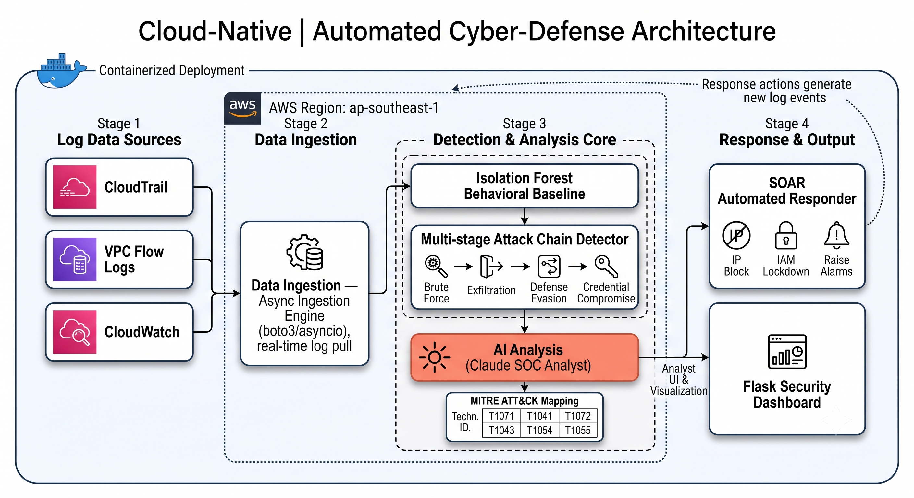

# Cloud Security AI Detector


An autonomous cloud security operations system that detects, analyzes, and responds to AWS threats in real time — without human intervention.

### 🔗 [View the live project walkthrough →](https://kaninnat-phu.github.io/Cloud-Security-AI-Detector/)


---

## Why this matters

Most organizations generate thousands of AWS log events per day across CloudTrail, VPC Flow Logs, and CloudWatch — far more than a human SOC analyst can monitor in real time. This system closes that gap end-to-end: it ingests logs from three AWS sources simultaneously, learns what "normal" looks like using machine learning, recognizes multi-step attack chains (brute force, data exfiltration, defense evasion, credential compromise), explains each threat in plain English with an AI SOC analyst mapped to MITRE ATT&CK, and automatically contains confirmed threats — blocking IPs, locking down compromised accounts, and raising alarms — all visible on a live dashboard.

In short: it's a working SIEM + SOAR pipeline built from scratch, not a wrapper around an existing tool.

---

## Results

- **3 AWS log sources** (CloudTrail, VPC Flow Logs, CloudWatch) ingested concurrently in real time via async streaming
- **4 of 4 attack chains detected** in testing (100% detection rate) end-to-end across log sources: brute force takeover, data exfiltration, defense evasion, credential compromise
- **Behavioral baseline** trained with Isolation Forest to flag anomalies without hand-written rules
- **End-to-end automated containment in ~6 seconds** against a live AWS account (measured), versus ~2–3 minutes performing the same actions manually in the console
- **5/5 automated response actions** executed successfully per incident (IP block, IAM lockdown, CloudWatch alarm, audit log, dashboard update)
- **Full MITRE ATT&CK mapping** (e.g. T1110, T1078, T1548) attached to every generated incident report

---

## Architecture
 



**Flow:** Log Data Sources (CloudTrail, VPC Flow Logs, CloudWatch) → Data Ingestion (async engine, real-time pull) → Detection & Analysis Core (Isolation Forest baseline → Multi-stage Attack Chain Detector → Claude SOC Analyst with MITRE ATT&CK mapping) → Response & Output (SOAR automated responder + Flask dashboard). Response actions feed back into the log sources, closing the loop.

---

## Skills Demonstrated

| Area | What's shown here |
|---|---|
| Cloud security engineering | Multi-source AWS log pipeline (CloudTrail, VPC Flow Logs, CloudWatch) in a real AWS region |
| Anomaly detection / ML | Isolation Forest behavioral baseline trained on historical event patterns |
| SOC analyst workflows | Multi-stage attack chain correlation across log sources, severity scoring |
| Threat intelligence | MITRE ATT&CK technique mapping generated per incident |
| Incident response automation (SOAR) | Automated IP blocking, IAM lockdown, CloudWatch alarms, audit logging |
| AI integration | Claude API used as an SOC analyst to generate plain-English incident reports |
| Software engineering | Async Python (boto3/asyncio), Flask dashboard, Dockerized deployment |

---

## Tech Stack

| Layer | Technology | Purpose |
|---|---|---|
| Cloud logging | AWS CloudTrail | API call monitoring |
| Network logging | AWS VPC Flow Logs | Network traffic analysis |
| App logging | AWS CloudWatch | Application event monitoring |
| Ingestion | Python, boto3, asyncio | Real-time streaming from 3 sources |
| Anomaly detection | scikit-learn (Isolation Forest) | ML-based behavioral baseline |
| Attack detection | Custom Python engine | Multi-step attack chain recognition |
| AI analysis | Claude API (Anthropic) | Plain-English incident reports |
| Auto response | Python, boto3 | Automated threat containment |
| Dashboard | Python Flask, HTML/CSS | Live monitoring interface |
| Containerization | Docker | Portable deployment |

---

## Quick Start

### Prerequisites
- Python 3.11+
- AWS account with CloudTrail, VPC Flow Logs, CloudWatch enabled
- Anthropic API key

### Setup

```bash
# Clone the repo
git clone https://github.com/Kaninnat-phu/Cloud-Security-AI-Detector.git
cd Cloud-Security-AI-Detector

# Install dependencies
pip install boto3 anthropic flask scikit-learn numpy aiofiles python-dotenv

# Configure environment
cp .env.example .env
# Edit .env with your AWS credentials and Anthropic API key

# Configure AWS CLI
aws configure

# Run the full pipeline + dashboard
python src/dashboard.py
```

Open **http://localhost:5001** in your browser.

### Run with Docker

```bash
docker build -t security-detector .
docker run -p 5001:5001 --env-file .env security-detector
```

### Verify detection metrics

A standalone test runs all four attack scenarios through the detector and times the automated response (works offline, falls back to simulated actions when AWS isn't reachable):

```bash
python measure_metrics.py
```

---

## Detection Capabilities

### Behavioral Baseline Engine
- Trains on historical events to learn normal patterns
- Detects deviations: unusual hours, new IPs, error spikes, high-risk APIs
- Uses Isolation Forest ML algorithm — the same general approach used by enterprise tools like Darktrace

### Attack Chain Detector
Recognizes multi-step attacks across all 3 log sources:

| Attack Type | Steps Detected |
|---|---|
| **Brute Force Takeover** | Failed logins → Successful access → Privilege escalation |
| **Data Exfiltration** | Reconnaissance → Data access → High outbound traffic |
| **Defense Evasion** | Disable logging → Delete evidence |
| **Credential Compromise** | New access key created → Immediately used |

### AI Incident Reports
Each detected threat generates a professional report including:
- Executive summary (non-technical)
- Technical attack narrative
- MITRE ATT&CK technique mapping (T1110, T1078, T1548, etc.)
- Affected resources
- Prioritized response actions

---

## Automated Response (SOAR)

When severity exceeds threshold (default: 7/10):

1. **Block attacker IP** — removes from security group ingress rules
2. **Lock down compromised user** — applies emergency deny-all IAM policy
3. **Create CloudWatch alarm** — monitors for repeat attempts
4. **Log incident** — writes full audit trail to CloudWatch

All actions logged with timestamps for compliance and forensics. Measured end-to-end containment time against a live AWS account: **~6 seconds**.

---

## Sample Output

**Attack chain detected:**
```
[ATTACK CHAIN DETECTED] BRUTE_FORCE_TAKEOVER
Severity: 9/10 | Steps completed: 3
  ✓ Multiple failed login attempts
  ✓ Successful login after failures
  ✓ Attempt to escalate privileges
```

**Automated response:**
```
[RESPONDER] ✓ BLOCK_IP: Blocked IP 192.168.1.100
[RESPONDER] ✓ DISABLE_USER: Emergency lockdown applied to victim-user
[RESPONDER] ✓ CREATE_ALARM: CloudWatch alarm created
[RESPONDER] ✓ LOG_INCIDENT: Incident logged to audit trail
Successful: 5/5
```

---

## Security Concepts Demonstrated

| Concept | Implementation |
|---|---|
| Log aggregation | 3 simultaneous AWS log sources |
| SIEM | Unified event correlation across sources |
| Behavioral analytics | Isolation Forest ML baseline |
| Threat intelligence | MITRE ATT&CK framework mapping |
| SOAR | Automated response to confirmed threats |
| Defense in depth | Multi-layer detection (rules + ML + AI) |
| Incident response | Structured report with severity scoring |
| Audit trail | All actions logged with timestamps |

---

## Project Structure

```
cloud-security-ai-detector/
├── src/
│   ├── ingestion.py      # Real-time streaming from 3 AWS sources
│   ├── baseline.py       # ML behavioral baseline + anomaly scoring
│   ├── attack_chain.py   # Multi-step attack pattern detection
│   ├── ai_analyst.py     # Claude AI incident report generation
│   ├── responder.py      # Automated SOAR response engine
│   └── dashboard.py      # Flask web dashboard
├── measure_metrics.py    # Runs all 4 attack scenarios + times response
├── logs/                 # Event storage (gitignored)
├── docs/                 # Architecture diagram, preview image
├── .env.example          # Environment variables template
├── Dockerfile            # Container configuration
└── README.md
```

---

## About

Built by **Kaninnat Phuangla-or** — 3rd year ICT student at Mahidol University, specialising in Network & Security.

🔗 [LinkedIn](https://www.linkedin.com/in/kaninnat-phungla-or/) · [GitHub](https://github.com/Kaninnat-phu)

---

## ⚠️ Disclaimer

This project is built for educational and portfolio purposes. The automated response functions include simulation modes to prevent unintended changes to production AWS environments, and have also been validated end-to-end against a live AWS account. Always test in a controlled environment.
