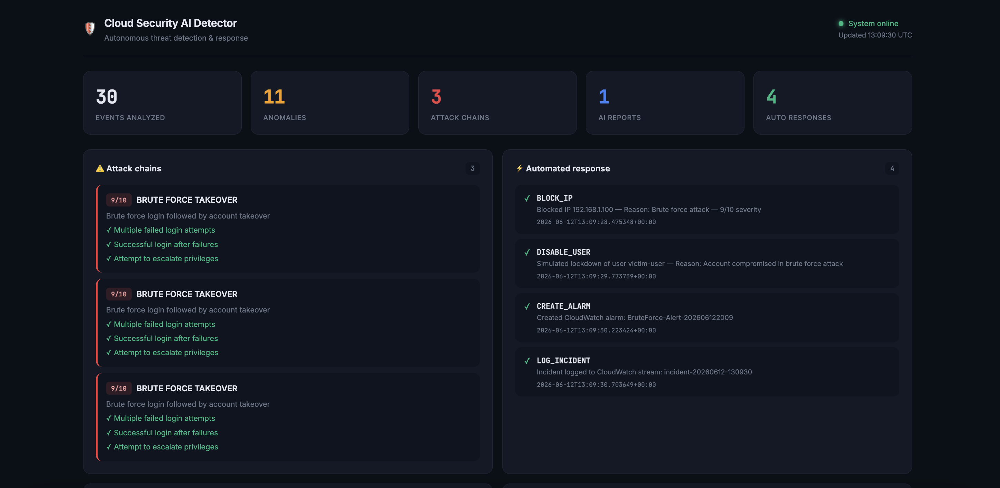

# 🛡️ Cloud Security AI Detector


An autonomous cloud security operations system that detects, analyzes, and responds to threats in real time — without human intervention.

### 🔗 [View the live project walkthrough →](https://kaninnat-phu.github.io/Cloud-Security-AI-Detector/)



---

## 🎯 What problem does this solve?

Most organizations generate thousands of AWS log events per day across multiple services. A human SOC analyst cannot monitor all of them simultaneously. This system automates the entire detection-to-response pipeline:

- **Ingests** logs from 3 AWS sources simultaneously in real time
- **Learns** what normal behavior looks like using ML
- **Detects** multi-step attack patterns across log sources
- **Explains** threats in plain English using Claude AI
- **Responds** automatically by blocking IPs and locking down compromised accounts
- **Displays** everything on a live web dashboard

---
## 🏗️ Architecture

```
AWS CloudTrail ──────────────┐
AWS VPC Flow Logs ───────────┼──→ Real-time Streaming Engine
AWS CloudWatch ──────────────┘         (Python asyncio)
                                            │
                              ┌─────────────┼─────────────┐
                              ▼             ▼             ▼
                    Behavioral         Attack Chain    Log Storage
                    Baseline Engine    Detector        (JSONL)
                    (Isolation Forest) (4 chain types)
                              │             │
                              └──────┬──────┘
                                     ▼
                            Claude AI SOC Analyst
                            (Incident Reports +
                             MITRE ATT&CK Mapping)
                                     │
                              ┌──────┴──────┐
                              ▼             ▼
                     Automated          Live Web
                     Responder          Dashboard
                     (SOAR layer)       (Flask)
                              │
                    ┌─────────┼─────────┐
                    ▼         ▼         ▼
                Block IP  Disable   Create CW
                          User      Alarm
```

---

## ⚙️ Tech Stack

| Layer | Technology | Purpose |
|---|---|---|
| Cloud logging | AWS CloudTrail | API call monitoring |
| Network logging | AWS VPC Flow Logs | Network traffic analysis |
| App logging | AWS CloudWatch | Application event monitoring |
| Ingestion | Python, boto3, asyncio | Real-time streaming from 3 sources |
| Anomaly detection | scikit-learn (Isolation Forest) | ML-based behavioral baseline |
| Attack detection | Custom Python engine | Multi-step attack chain recognition |
| AI analysis | Claude API (Anthropic) | Plain-English incident reports |
| Auto response | AWS Lambda, boto3 | Automated threat containment |
| Dashboard | Python Flask, HTML/CSS | Live monitoring interface |
| Containerization | Docker | Portable deployment |

---

## 🔍 Detection Capabilities

### Behavioral Baseline Engine
- Trains on historical events to learn normal patterns
- Detects deviations: unusual hours, new IPs, error spikes, high-risk APIs
- Uses Isolation Forest ML algorithm — same approach as enterprise tools like Darktrace

### Attack Chain Detector
Recognizes multi-step attacks across all 3 log sources:

| Attack Type | Steps Detected |
|---|---|
| **Brute Force Takeover** | Failed logins → Successful access → Privilege escalation |
| **Data Exfiltration** | Reconnaissance → Data access → High outbound traffic |
| **Defense Evasion** | Disable logging → Delete evidence |
| **Credential Compromise** | New access key created → Immediately used |

### AI Incident Reports
Each detected threat generates a professional report including:
- Executive summary (non-technical)
- Technical attack narrative
- MITRE ATT&CK technique mapping (T1110, T1078, T1548, etc.)
- Affected resources
- Prioritized response actions

---

## ⚡ Automated Response (SOAR)

When severity exceeds threshold (default: 7/10):

1. **Block attacker IP** — removes from security group ingress rules
2. **Lock down compromised user** — applies emergency deny-all IAM policy
3. **Create CloudWatch alarm** — monitors for repeat attempts
4. **Log incident** — writes full audit trail to CloudWatch

All actions logged with timestamps for compliance and forensics.

---

## 📁 Project Structure

```
cloud-security-ai-detector/
├── src/
│   ├── ingestion.py      # Real-time streaming from 3 AWS sources
│   ├── baseline.py       # ML behavioral baseline + anomaly scoring
│   ├── attack_chain.py   # Multi-step attack pattern detection
│   ├── ai_analyst.py     # Claude AI incident report generation
│   ├── responder.py      # Automated SOAR response engine
│   └── dashboard.py      # Flask web dashboard
├── logs/                 # Event storage (gitignored)
├── .env.example          # Environment variables template
├── Dockerfile            # Container configuration
└── README.md
```

---

## 🚀 Quick Start

### Prerequisites
- Python 3.11+
- AWS account with CloudTrail, VPC Flow Logs, CloudWatch enabled
- Anthropic API key

### Setup

```bash
# Clone the repo
git clone https://github.com/Kaninnat-phu/Cloud-Security-AI-Detector.git
cd Cloud-Security-AI-Detector

# Install dependencies
pip install boto3 anthropic flask scikit-learn numpy aiofiles python-dotenv

# Configure environment
cp .env.example .env
# Edit .env with your AWS credentials and Anthropic API key

# Configure AWS CLI
aws configure

# Run the full pipeline + dashboard
python src/dashboard.py
```

Open **http://localhost:5001** in your browser.

### Run with Docker

```bash
docker build -t security-detector .
docker run -p 5001:5001 --env-file .env security-detector
```

---

## 🔬 Security Concepts Demonstrated

| Concept | Implementation |
|---|---|
| Log aggregation | 3 simultaneous AWS log sources |
| SIEM | Unified event correlation across sources |
| Behavioral analytics | Isolation Forest ML baseline |
| Threat intelligence | MITRE ATT&CK framework mapping |
| SOAR | Automated response to confirmed threats |
| Defense in depth | Multi-layer detection (rules + ML + AI) |
| Incident response | Structured report with severity scoring |
| Audit trail | All actions logged with timestamps |


---

## 📊 Sample Output

**Attack chain detected:**
```
[ATTACK CHAIN DETECTED] BRUTE_FORCE_TAKEOVER
Severity: 9/10 | Steps completed: 3
  ✓ Multiple failed login attempts
  ✓ Successful login after failures
  ✓ Attempt to escalate privileges
```

**Automated response:**
```
[RESPONDER] ✓ BLOCK_IP: Blocked IP 192.168.1.100
[RESPONDER] ✓ DISABLE_USER: Emergency lockdown applied to victim-user
[RESPONDER] ✓ CREATE_ALARM: CloudWatch alarm created
[RESPONDER] ✓ LOG_INCIDENT: Incident logged to audit trail
Successful: 5/5
```

---

## 👤 About

Built by **Kaninnat Phunglaor** — 3rd year ICT student at Mahidol University, specialising in Network & Security.


🔗 [LinkedIn](https://www.linkedin.com/in/kaninnat-phungla-or/)

---

## ⚠️ Disclaimer

This project is built for educational and portfolio purposes. The automated response functions include simulation modes to prevent unintended changes to production AWS environments. Always test in a controlled environment.
